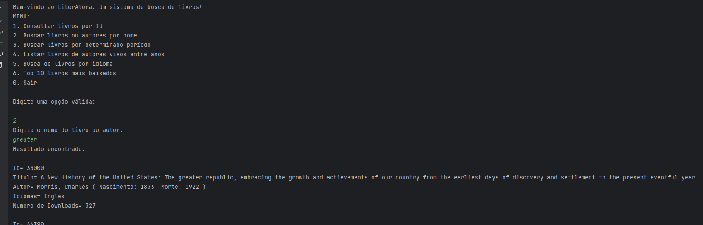
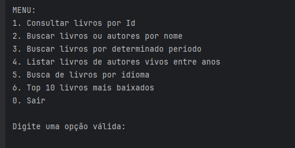

# Projeto LiterAlura

## Visão Geral

Bem-vindo ao LiterAlura! Este é um projeto desenvolvido como conclusão de etapa do curso da Escola Alura em parceria com o projeto One Oracle + Alura. LiterAlura é uma aplicação web que permite aos usuários navegar e filtrar uma coleção de livros, com uma interface amigável e interativa.




## Funcionalidades

- Exibição de uma lista de livros.
- Filtro por idiomas.
- Busca no banco de dados dos livros adicionados
- Busca por autor vivo no perído
- Detalhes de cada livro, incluindo título, autor, idiomas disponíveis, e número de downloads.

## Tecnologias Utilizadas


- **Backend:**Implementado com **Java** e **Spring Boot MVC**, utilizando **Postgres** como sistema de gerenciamento de banco de dados. 
- **API rest:** Disponibilizada pelo site https://gutendex.com/
- **Entity:** Utilizamos o conceito de Entidades no contexto do JPA (Java Persistence API) para mapear nossas classes Java às tabelas do banco de dados.
- **Java:** Java é uma linguagem de programação robusta e orientada a objetos, escolhida pela sua portabilidade e eficiência. 
- **JPA (Java Persistence API):** Framework utilizado para gerenciar o relacionamento entre objetos Java e o banco de dados em uma aplicação Java EE. O JPA facilita o desenvolvimento de aplicações que necessitam de acesso a banco de dados, abstraindo a complexidade das operações CRUD (Create, Read, Update, Delete).

- **Apache:** Para mapeamento de endpoints.
Obs.: Para consultas na API foi utilizado o Apache postman.

## Aprendizados

Este projeto foi bem complicado e difícil de concluir, mas cheio de aprendizados. Aqui estão alguns dos principais conceitos e práticas que foram aplicados:

1. **Mapeamento de Endpoints:** Utilizamos anotações como @RestController, @RequestMapping, para mapear requisições e rotas, facilitando a comunicação entre o sistema e o banco de dados.
2. **Controlador REST:** Criamos controladores para processar requisições, garantindo uma separação clara entre a lógica de apresentação e a lógica de negócio.
3. **Boas Práticas:** Implementamos classes de serviço anotadas com @Service, mantendo nossos controladores focados e organizados.
4. **Configuração CORS:** Configuramos o Cross-Origin Resource Sharing (CORS) para permitir que a API seja acessada de forma segura e controlada.
5. **Arquitetura MVC:** Adotamos a arquitetura Model-View-Controller (MVC), separando claramente a lógica de negócio, a interface do usuário e o controle de fluxo.
6. **DTO (Data Transfer Object):** Utilizamos DTOs para transferir dados de forma eficiente e segura entre diferentes camadas da aplicação.


## Desafios e Superação

Este projeto foi um dos mais difíceis e trabalhoso no qual já trabalhei. Enfrentei muitos desafios e, em várias ocasiões, travei em problemas complexos. Houve muitos momentos de frustração, mas a medida que avançava, via que estava conseguindo entender sobre o contexto e ficava muito alegre. Com muita persistência, resiliencia e dedicação, consegui fazer o projeto funcionar corretamente.

## Como Executar o Projeto

1. **Clone o repositório:**
    ```bash
    git clone https://github.com/LeandroGoulart/leandro-LiterAlura.git
    ```
2. **Navegue até o diretório do projeto:**
    ```bash
    cd LiterAlura
    ```
3. **Instale as dependências do backend:**
    ```bash
    mvn install
    ```
4. **Inicie o servidor backend:**
    ```bash
    mvn spring-boot:run
    ```
5. **Interaja com a aplicação através de comandos no terminal.**
   
   MENU:




A opçao 1 te dá detalhes específicos de um livro. Caso não saiba o ID, procurar pela opção 2.

Função 2, 3 e 4 busca direto no site, através da api.

Função 5 e 6 faz a busca direto no banco de dados.

## Conclusão

A jornada de desenvolvimento do LiterAlura foi uma experiência construtiva e desafiadora. Agradeço a Escola Alura e ao projeto One Oracle + Alura pela oportunidade de aprendizado e crescimento.

Sinta-se à vontade para explorar, modificar e melhorar o projeto. Qualquer feedback ou sugestão será muito bem-vindo!

Vamos continuar aprendendo e superando desafios juntos!

---

**Desenvolvido por:**
Goulart
